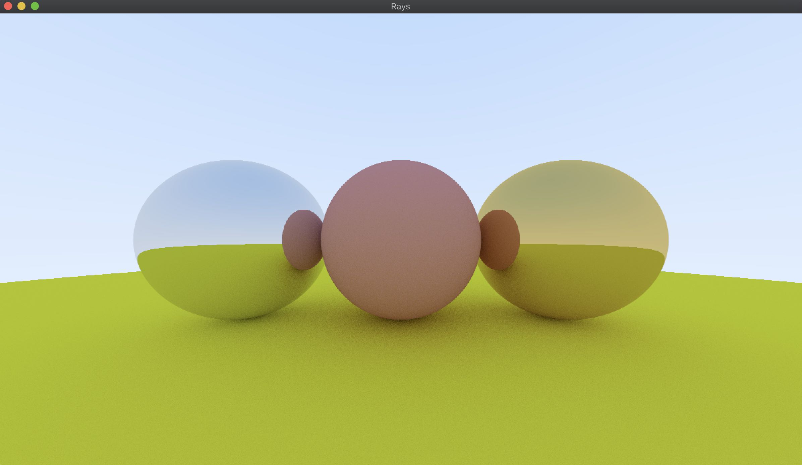

Rays
====

Rays is a toy raytracer implemented in Rust. It is based on ["Ray Tracing in One Weekend"](https://raytracing.github.io/books/RayTracingInOneWeekend.html).

### Features
  * Renders in real time using the [Pixels crate](https://crates.io/crates/pixels) for a performance cross-platform pixel frame buffer.
  * Utilizes [winit](https://crates.io/crates/winit) for cross-platform window and event-loop management
  * Navigate the scene with WASD (scene is re-rendered when the camera viewpoint changes).
  * Multi-threaded using scoped threads with [rayon](https:/crates.io/crates/rayon).

### Example Output

### Up Next
  * Fuzzy reflections
  * Dielectric materials
  * Clean up and refactor abstractions (such as Camera)
  * Allow for changing camera direction using mouse input
  * Make number of threads used configurable
  * Use a dynamic resolution for quickly navigating the scene
  * Documentation
